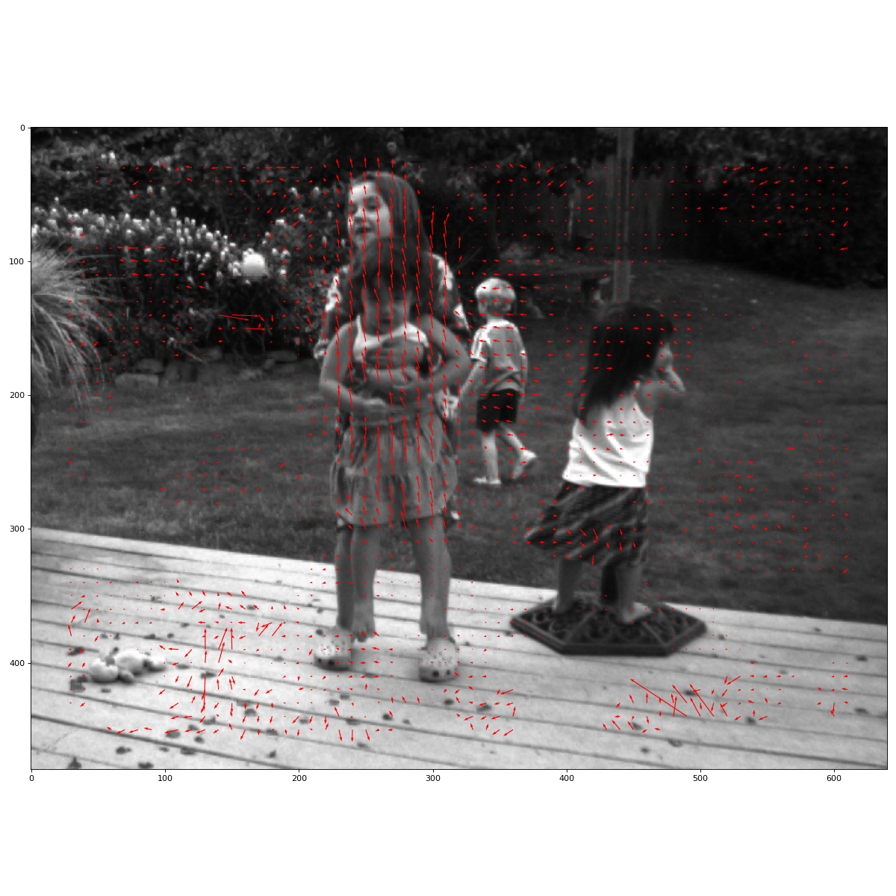
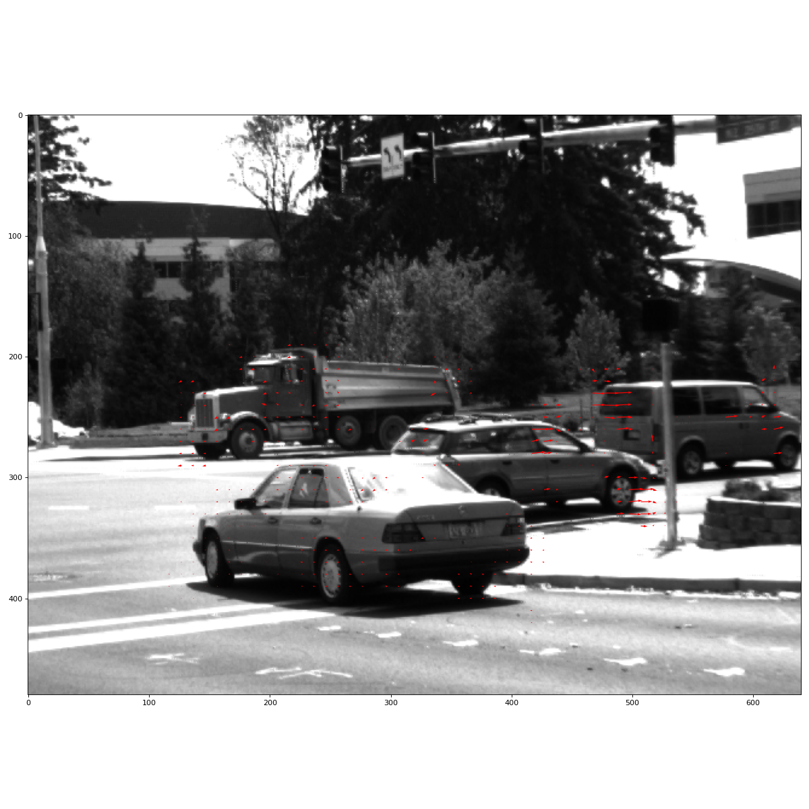
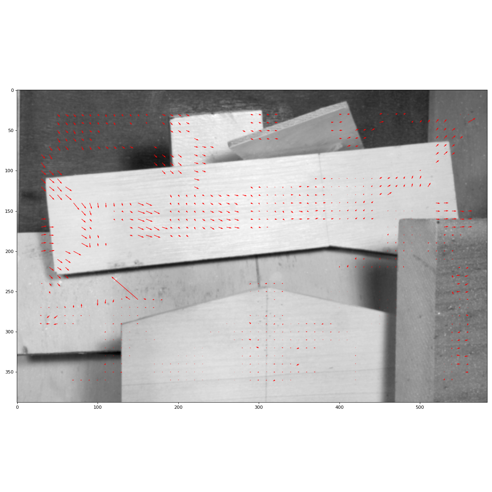
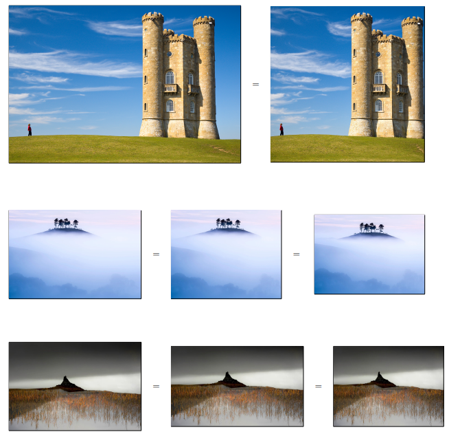
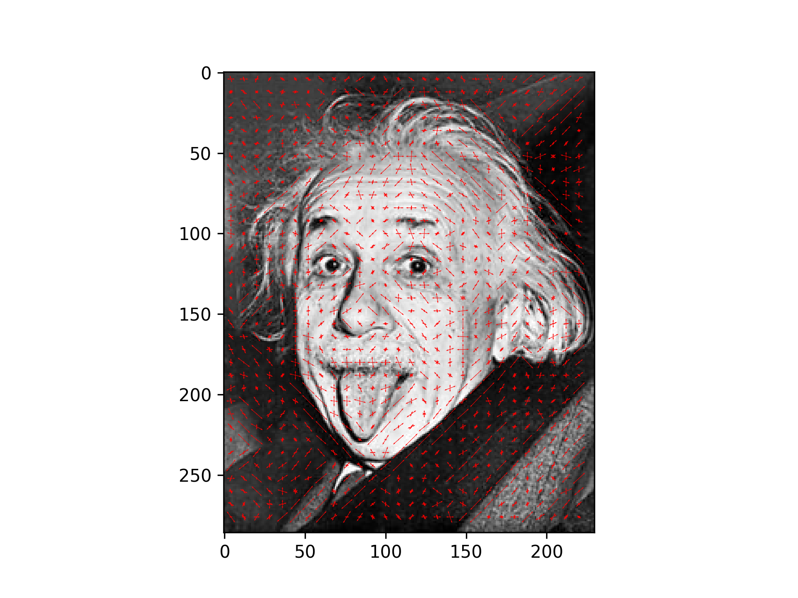

# Computer Vision Scripts
Some computer vision scripts. This repo contains the code and this README includes some outputs produced by the source code.  
## Optical Flow  
Calculated on the mid frame of a sequence of images. The arrows represent the magnitude and direction of the movement.

## Seam Carving 

## Histogram Of Oriented Gradients (HOG)

